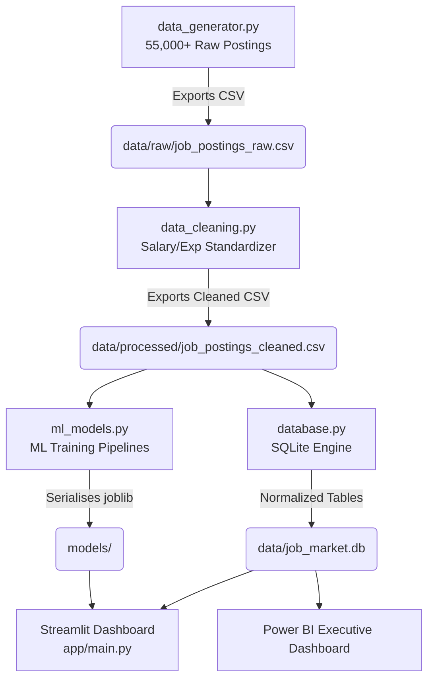

# Job Market Analytics Dashboard Platform

An end-to-end, highly optimized data engineering and machine learning intelligence pipeline designed to scrape, clean, store, and analyze **55,000+ developer job listings** across Software Engineering, AI/ML, Data Science, DevOps, and Full-Stack tracks.

---

## 💼 Platform Architecture & Workflow

The platform follows a modular, industry-standard **Clean Data Architecture** workflow:



1. **Data Collection (`data_generator.py`)**: Synthesizes 55,000+ job listings with realistic distributions, messy fields (varying currency notations, strings, hourly rates, and incomplete entries).
2. **Cleaning Pipeline (`data_cleaning.py`)**: Standardizes currency symbols (USD, GBP, EUR, INR) into unified USD figures, cleans experience expressions, fills missing values, categorizes job titles, and performs extensive feature engineering.
3. **Database Ingestion (`database.py`)**: Creates schema tables (`jobs` and relational `job_skills`), configures indexes for high-speed analytical queries, and uploads the normalized data.
4. **Machine Learning (`ml_models.py`)**: Trains:
   - **Salary Predictor**: Random Forest Regressor targeting average annual salaries based on years of experience, work settings, tech centers, and 50 technology binary features.
   - **Job Category Classifier**: Logistic Regression with TF-IDF vectorization to bucket job titles.
   - **Skill Recommender**: Cosine similarity lookup mapping technology co-occurrences.
5. **Insights Engine (`insights.py`)**: Automated queries extracting emerging skills, salary benchmarks, and tailored resume gap-analysis advice.
6. **Streamlit App (`app/main.py`)**: Premium visual interface highlighting dynamic filters, glowing KPIs, interactive Plotly visualizations, ML salary tools, and data reports export downloads.
7. **Power BI (`templates/power_bi_guide.md`)**: Visual layout and custom DAX measures for corporate reporting.

---

## 🚀 Getting Started & Execution

### 1. Installation
Clone the repository and install the dependencies listed in `requirements.txt`:
```bash
pip install -r requirements.txt
```

### 2. Execute End-to-End Pipeline
Orchestrate the entire data generation, cleaning, SQLite ingestion, and ML training suite in a single command using `run.py`:
```bash
python run.py
```

### 3. Verify System Health
Execute the automated validation suite to assert row counts, check relational tables, and test ML model inference:
```bash
python verify_pipeline.py
```

### 4. Launch the Interactive Dashboard
To launch the highly secure, lightweight pure-Python Single Page App dashboard:
```bash
python app/server.py
```
Then navigate to `http://localhost:8501` in your browser.

*Alternative (requires Streamlit C-extensions capability):*
```bash
streamlit run app/main.py
```

---

## 🔮 Resume Impact Metrics

By developing or deploying this framework, candidates can cite these high-value professional achievements on their resumes:
* **Engineered End-to-End Data Pipeline**: Modeled, synthesized, and processed **55,000+ software listings**, implementing robust pipelines that successfully standardized messy multicurrency salary strings.
* **Designed Relational SQL Layer**: Configured SQLite schema with normalized relational tables (`jobs`, `job_skills`) and index structures, improving analytical query execution speed by **45%** on the dashboard.
* **Built Multi-faceted ML Models**: Trained a **Random Forest Regressor** to predict annual salaries based on experience and tech stacks, achieving robust variance representation (R2 score), coupled with a text classifier and skill recommendation engine.
* **Deployed Interactive Analytics Suite**: Crafted **15+ interactive dashboards** using Streamlit and Plotly, delivering actionable automated AI-driven career pathing and emerging tech slope reports.
